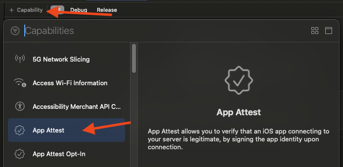
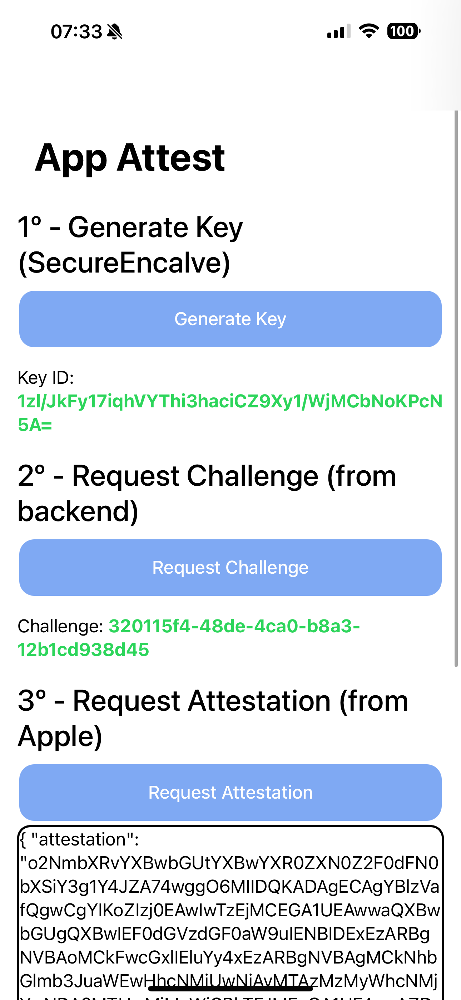
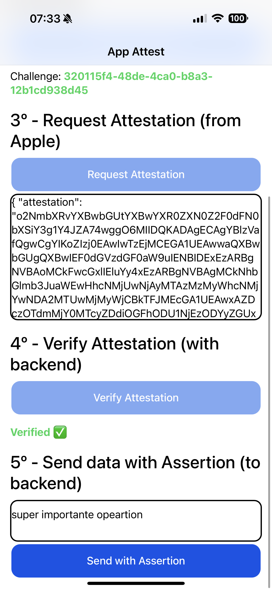
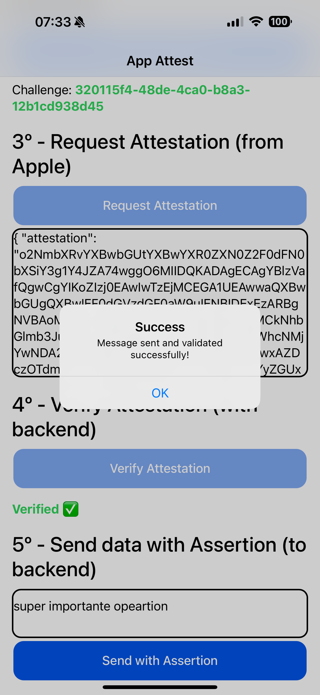

<p align="center"><br></p>
<h3 align="center">App Attest</h3>
<p align="center"><strong><code>capacitor-app-attest</code></strong></p>
<p align="center">
  Ionic Capacitor plugin for <a href="https://developer.apple.com/videos/play/wwdc2021/10244/">App Attest</a> from Apple

<p align="center">
  
  <a href="https://www.npmjs.com/package/capacitor-app-attest"></a>
  <a href="https://www.npmjs.com/package/capacitor-app-attest"></a>
  <a href="https://www.npmjs.com/package/capacitor-app-attest"></a>
<!-- ALL-CONTRIBUTORS-BADGE:START - Do not remove or modify this section -->
<a href="#contributors-"></a>
<!-- ALL-CONTRIBUTORS-BADGE:END -->
<br />
<a href="https://www.buymeacoffee.com/ludufre"></a>
</p>

## Maintainers

| Maintainer             | GitHub                                | Social                            | LinkedIn                                                           |
| ---------------------- | ------------------------------------- | --------------------------------- | ------------------------------------------------------------------ |
| Luan Freitas (ludufre) | [ludufre](https://github.com/ludufre) | [@ludufre](https://x.com/ludufre) | [Luan Freitas](https://www.linkedin.com/in/luan-freitas-14341687/) |

## Installation

```bash
npm install capacitor-app-attest
npx cap sync

# or using pnpm
pnpm install capacitor-app-attest
npx cap sync
```

### Add `App Attest` capability to your iOS project in Xcode.



## Examples

[Example App](./example-app/README.md) | [Example Backend](./example-backend/README.md)

<p>



</p>

## Credits

This plugin is based on the [App Attest](https://developer.apple.com/documentation/devicecheck/establishing-your-app-s-integrity) feature from Apple, which provides a way to attest the integrity of your app and its interactions with your backend. WWDC 2021 session [10244](https://developer.apple.com/videos/play/wwdc2021/10244/) provides a good overview of how to use it.

Backend validation example in `./example-backend` is based on the [node-app-attest-example](https://github.com/uebelack/node-app-attest-example) ([@uebelack](https://github.com/uebelack)).

<a href="https://www.buymeacoffee.com/ludufre"></a>

## API

<docgen-index>

- [`isSupported()`](#issupported)
- [`generateKey()`](#generatekey)
- [`attestKey(...)`](#attestkey)
- [`generateAssertion(...)`](#generateassertion)
- [`storeKeyId(...)`](#storekeyid)
- [`getStoredKeyId()`](#getstoredkeyid)
- [`clearStoredKeyId()`](#clearstoredkeyid)

</docgen-index>

<docgen-api>
<!--Update the source file JSDoc comments and rerun docgen to update the docs below-->

### isSupported()

```typescript
isSupported() => Promise<{ isSupported: boolean; }>
```

Checks if App Attest is supported on the device

**Returns:** <code>Promise&lt;{ isSupported: boolean; }&gt;</code>

---

### generateKey()

```typescript
generateKey() => Promise<{ keyId: string; }>
```

Generates a new key for App Attest

**Returns:** <code>Promise&lt;{ keyId: string; }&gt;</code>

---

### attestKey(...)

```typescript
attestKey(options: { keyId: string; challenge: string; }) => Promise<{ attestation: string; keyId: string; challenge: string; }>
```

Attests a key using a challenge

| Param         | Type                                               | Description                                  |
| ------------- | -------------------------------------------------- | -------------------------------------------- |
| **`options`** | <code>{ keyId: string; challenge: string; }</code> | - Object containing the keyId and challenge. |

**Returns:** <code>Promise&lt;{ attestation: string; keyId: string; challenge: string; }&gt;</code>

---

### generateAssertion(...)

```typescript
generateAssertion(options: { keyId: string; payload: string; }) => Promise<{ assertion: string; keyId: string; }>
```

Generates an assertion for a payload

| Param         | Type                                             | Description                               |
| ------------- | ------------------------------------------------ | ----------------------------------------- |
| **`options`** | <code>{ keyId: string; payload: string; }</code> | - Object containing the keyId and payload |

**Returns:** <code>Promise&lt;{ assertion: string; keyId: string; }&gt;</code>

---

### storeKeyId(...)

```typescript
storeKeyId(options: { keyId: string; }) => Promise<{ success: boolean; }>
```

Stores the keyId locally in UserDefaults

| Param         | Type                            | Description                             |
| ------------- | ------------------------------- | --------------------------------------- |
| **`options`** | <code>{ keyId: string; }</code> | - Object containing the keyId to store. |

**Returns:** <code>Promise&lt;{ success: boolean; }&gt;</code>

---

### getStoredKeyId()

```typescript
getStoredKeyId() => Promise<{ keyId: string | null; hasStoredKey: boolean; }>
```

Retrieves the stored keyId locally

**Returns:** <code>Promise&lt;{ keyId: string | null; hasStoredKey: boolean; }&gt;</code>

---

### clearStoredKeyId()

```typescript
clearStoredKeyId() => Promise<{ success: boolean; }>
```

Removes the stored keyId

**Returns:** <code>Promise&lt;{ success: boolean; }&gt;</code>

---

</docgen-api>
