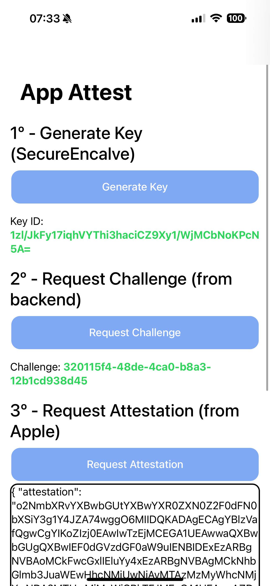
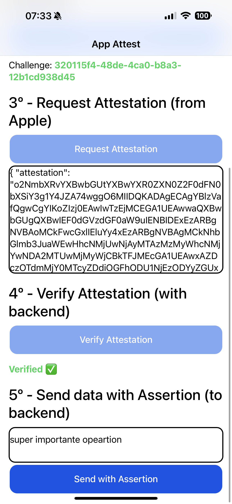
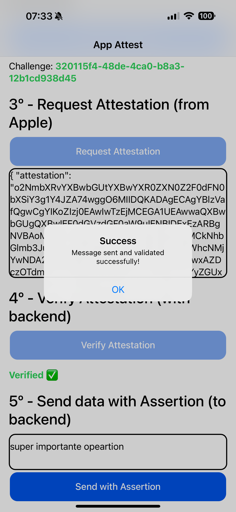

# Capacitor App Attest Example

This is an example project for the Capacitor App Attest plugin.

## Usage

Change the bundle identifier and team identifier in Xcode project settings.

Update the `src/environment/environment.ts` with your backend address.

```typescript
export const environment = {
  ...
  endpoint: 'http://172.29.8.1:8080',
};
```

<p>



</p>

### Commands

```bash
pnpm install

# For iOS
ionic cap run ios
```

## Example Backend

You can find an example of the backend in `../example-backend` folder of this project.

The backend is a simple TypeScript server that handles App Attest requests. It uses environment variables for configuration, so you need to create a `.env` file in the `example-backend` directory with your App bundle identifier and Team identifier from your Apple Developer account.

See [README.md](https://github.com/ludufre/capacitor-app-attest/blob/main/README.md) for more details on how to use the plugin.
